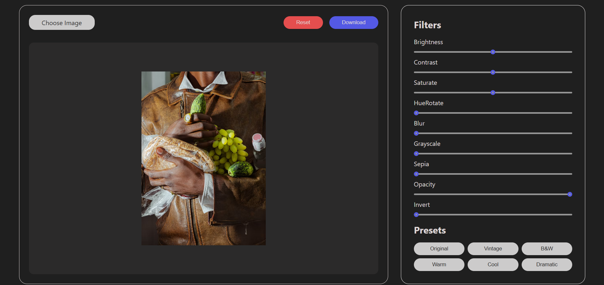
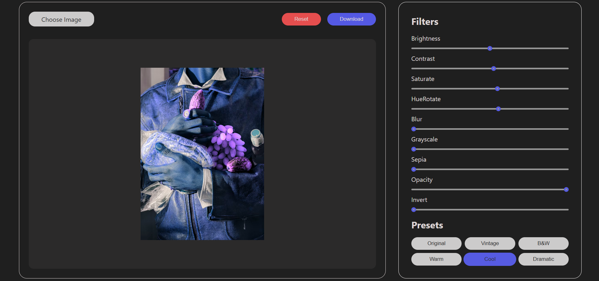

# JavaScript Image Editor

A simple image editor built with vanilla HTML, CSS, and JavaScript using the HTML Canvas API - no frameworks, no libraries.





## ✨ Features

- Upload and display images
- Adjust image brightness
- Adjust image contrast
- Apply image filters
- Reset image changes
- Download the edited image

## 🔗 Live Demo

[View Live Demo](https://js-image-editor-eight.vercel.app/)

## 🛠️ Built With

- HTML5
- CSS3
- Vanilla JavaScript
- HTML Canvas API

## 🚀 Getting Started

Clone the repo and open `index.html` in your browser — no build step required.

```bash
git clone https://github.com/bangarukondabollapally/js-image-editor.git
cd js-image-editor
```

## 📚 What I Learned

Building this project helped me understand how image editing works in the browser:

- Working with the HTML Canvas API
- Loading and displaying images dynamically
- Applying filters and transformations to images
- Managing canvas state and resetting changes
- Exporting and downloading edited images